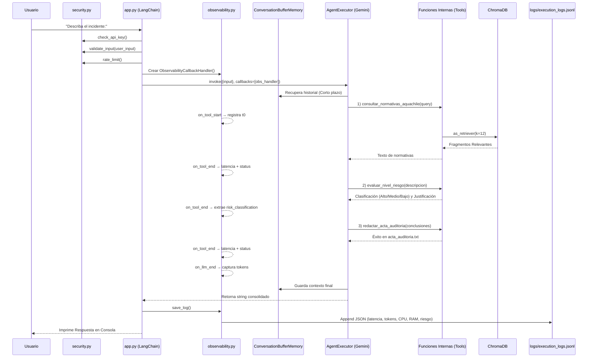

# Auditor de Prevención de Riesgos - AquaChile

**Evaluación Parcial N°2 y N°3 - ISY0101 (DuocUC)**
**Autor:** Carlos Ignacio Bittner Navea

Este proyecto implementa un Agente Funcional autónomo construido con LangChain. El sistema orquesta un flujo de auditoría delegando tareas a herramientas específicas, implementando Retrieval-Augmented Generation (RAG) con ChromaDB y evaluando incidentes laborales mediante Gemini. En la EP3 se incorporó una capa completa de **observabilidad**, **seguridad** y **monitoreo visual** sobre el agente existente.

## Instrucciones de Instalación

1. **Clonar y acceder al proyecto**
   ```bash
   git clone <URL_DEL_REPOSITORIO>
   cd evaluacion-ia
   ```

2. **Entorno Virtual (Opcional pero recomendado)**
   ```bash
   python3 -m venv venv
   source venv/bin/activate  # Windows: venv\Scripts\activate
   ```

3. **Instalación de Dependencias**
   ```bash
   pip install -r requirements.txt
   ```

4. **Variables de Entorno**
   Crea un archivo `.env` en la raíz del proyecto y agrega tu llave de Google Gemini:
   ```env
   GOOGLE_API_KEY=tu_clave_api_aqui
   ```

5. **Generar Base de Datos Vectorial (Solo la primera vez)**
   Por buenas prácticas, la carpeta `chroma_db_seguridad` no se incluye en el código fuente. Antes de usar el agente, debes ejecutar el script de inicialización para crear los embeddings a partir del PDF:
   ```bash
   python3 app_rag_basico.py
   ```

## Ejecución del Agente

Para iniciar el orquestador interactivo en consola, ejecuta:
```bash
python3 app.py
```
El agente te pedirá que ingreses un reporte de incidente. Automáticamente consultará normativas, evaluará riesgos y generará el archivo `acta_auditoria.txt`. Cada ejecución registra métricas de observabilidad en `logs/execution_logs.jsonl`.

## EP3 — Observabilidad, Seguridad y Dashboard

### Módulo de Observabilidad (`observability.py`)

Instrumenta cada ejecución del agente capturando las siguientes métricas en tiempo real mediante `BaseCallbackHandler` de LangChain:

| Métrica | Descripción técnica | Propósito |
|---|---|---|
| `total_latency_ms` | Tiempo total de ejecución en milisegundos (`time.perf_counter`) | Detectar degradación de rendimiento |
| `tool_latencies_ms` | Latencia individual de cada herramienta (consultar, evaluar, redactar) | Identificar cuellos de botella por herramienta |
| `input_tokens` / `output_tokens` | Tokens consumidos por el LLM separados por dirección | Controlar costos de API y optimizar prompts |
| `total_tokens` | Suma total de tokens por ejecución | Monitorear consumo acumulado |
| `tool_status` | Estado de cada herramienta: `success` o `error` | Calcular tasa de fallo por componente |
| `risk_classification` | Clasificación emitida: Alto, Medio o Bajo | Medir consistencia del evaluador de riesgos |
| `cpu_percent` | Uso de CPU al inicio y al final de la ejecución (`psutil`) | Detectar sobrecarga de recursos del sistema |
| `ram_percent` | Uso de RAM al inicio y al final de la ejecución (`psutil`) | Prevenir agotamiento de memoria |

Los registros se almacenan en formato JSONL (un JSON por línea) en `logs/execution_logs.jsonl`, siempre en modo append para preservar el historial.

### Módulo de Seguridad (`security.py`)

Aplica tres capas de defensa antes de que el input llegue al agente:

1. **Verificación de credenciales**: Valida que `GOOGLE_API_KEY` exista en el entorno antes de iniciar. El valor de la clave nunca se imprime ni se registra en logs.
2. **Validación y sanitización de inputs**: Rechaza inputs vacíos o menores a 10 caracteres. Detecta patrones de inyección de prompt en español e inglés mediante expresiones regulares. Sanitiza caracteres HTML (`<`, `>`) y plantillas (`{{`, `}}`).
3. **Rate limiting**: Limita la frecuencia a un máximo de 10 ejecuciones por ventana deslizante de 60 segundos, implementado con `collections.deque`.

### Dashboard de Observabilidad (`dashboard.py`)

Panel interactivo construido con Streamlit y Plotly que consume exclusivamente datos reales del archivo JSONL:

```bash
streamlit run dashboard.py
```

El dashboard presenta:
- **KPIs numéricos**: Total de ejecuciones, tokens consumidos, latencia promedio, uso de CPU y RAM.
- **Gráfico de barras**: Latencia promedio por herramienta para identificar cuellos de botella.
- **Gráfico de torta**: Distribución de clasificaciones de riesgo emitidas (Alto/Medio/Bajo) con colores semánticos.
- **Gráfico de barras apiladas**: Tasa de éxito vs. fallo acumulada por herramienta.
- **Tabla de registros**: Últimos 10 registros de ejecución con ID, timestamp, tokens, riesgo y recursos.

Los datos se actualizan automáticamente cada 30 segundos mediante cache con TTL.

## Diagrama de Arquitectura (Mermaid)

El siguiente diagrama detalla la arquitectura completa del sistema, incluyendo los módulos de observabilidad y seguridad incorporados en la EP3.


