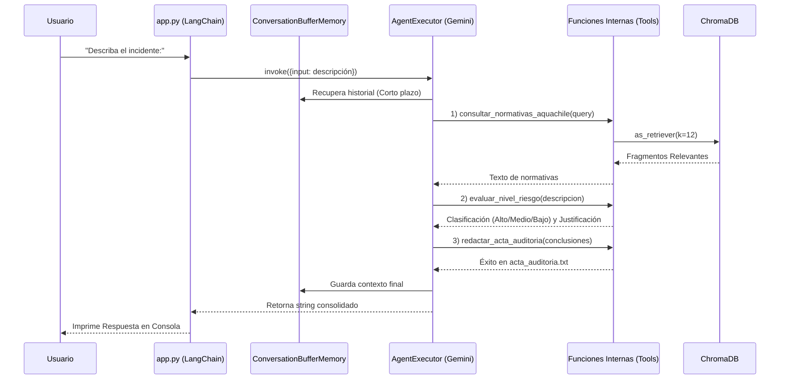

# Auditor de Prevención de Riesgos - AquaChile

**Evaluación Parcial N°2 - ISY0101 (DuocUC)**
**Autor:** Carlos Ignacio Bittner Navea

Este proyecto implementa un Agente Funcional autónomo construido con LangChain. El sistema orquesta un flujo de auditoría delegando tareas a herramientas específicas, implementando Retrieval-Augmented Generation (RAG) con ChromaDB y evaluando incidentes laborales mediante Gemini.

## Instrucciones de Instalación

1. **Clonar y acceder al proyecto**
   ```bash
   git clone <URL_DEL_REPOSITORIO>
   cd evaluacion-ia
   ```

2. **Entorno Virtual (Opcional pero recomendado)**
   ```bash
   python3 -m venv venv
   source venv/bin/activate  # Windows: venv\Scripts\activate
   ```

3. **Instalación de Dependencias**
   ```bash
   pip install -r requirements.txt
   ```

4. **Variables de Entorno**
   Crea un archivo `.env` en la raíz del proyecto y agrega tu llave de Google Gemini:
   ```env
   GOOGLE_API_KEY=tu_clave_api_aqui
   ```

5. **Generar Base de Datos Vectorial (Solo la primera vez)**
   Por buenas prácticas, la carpeta `chroma_db_seguridad` no se incluye en el código fuente. Antes de usar el agente, debes ejecutar el script de inicialización para crear los embeddings a partir del PDF:
   ```bash
   python3 app_rag_basico.py
   ```

## Ejecución del Agente

Para iniciar el orquestador interactivo en consola, ejecuta:
```bash
python3 app.py
```
El agente te pedirá que ingreses un reporte de incidente. Automáticamente consultará normativas, evaluará riesgos y generará el archivo `acta_auditoria.txt`.

## Diagrama de Arquitectura (Mermaid)

El siguiente diagrama detalla la arquitectura empleada en el código. El orquestador delega las tareas a las herramientas internas.


